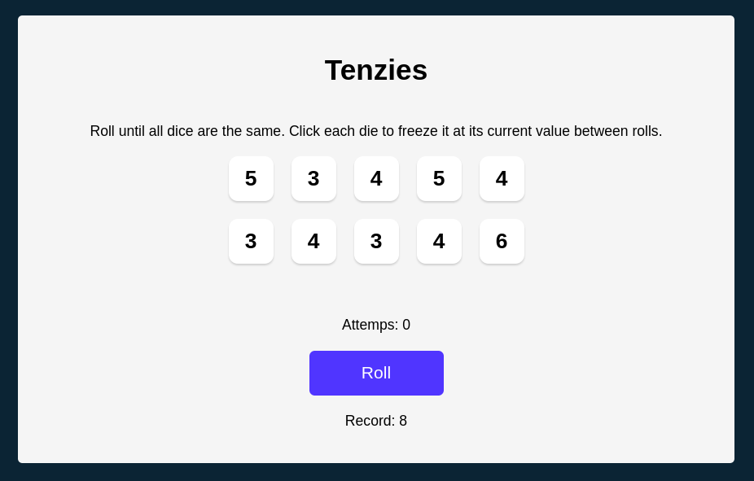

# Tenzies

Tenzies è un giochino che consisten nell'avere la stessa faccia del dado su tutti i dadi. Si seleziona una faccia di un dado e si "ritirano" gli altri dadi fino a che tutti non abbiano lo stesso numero, l'obiettivo è di farlo in meno numeri possibili!

Il progetto è realizzato con REACT, utilizzando *useState* per gestire i vari stati del progetto come le facce del dado, *useEffect* per controllare se sono rivato al termine del gioco e ho "vinto" e il *Local storage* per tener conto del record fatto a Tenzies

SKILL APPRESE:
- React
- *useState, useEffect, Local storage* cin REACT
- CSS